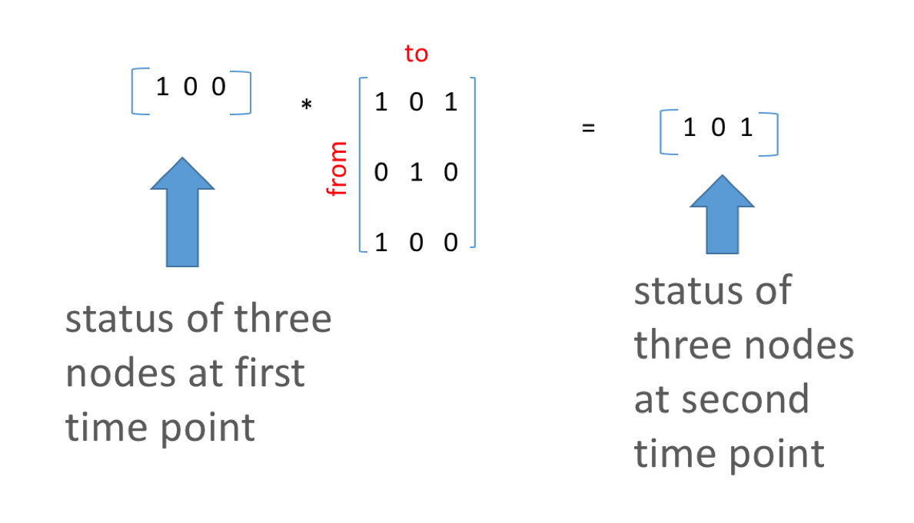

* [Epidemic Networks](PDFFiles/ICPP2018_EpidemicNetworks.pdf)

## Matrices in R: Epidemic spread over time


First, load the libraries that we will use in this module. 
```{r}
library(igraph)
library(tidyverse)
```


Using the symbol '*' in R multiplies each element of a matrix by the corresponding element of another matrix. This is 'element-wise multiplication', rather than matrix multiplication. 

```{r}
X1 <- matrix(1:9,ncol=3)
X1
X2 <- matrix(21:29,ncol=3)
X2
X1 * X2 ## element wise multiplication
X1 %*% X2 ## Matrix multiplication
```


## Matrix Multiplication  
\  


Matrix multiplication is a concept from liner algebra that helps us work mathematically with matrices. Unlike when adding two matrices together, we do not go element-wise when getting the product of matrices. Using matrix multiplication, we can visualize the process by which infections spread through networks over time.  
\  
A simple example of matrix multiplication:

$$
\left[\begin{array}{rrr} 
A & B\\
C & D \\
\end{array}\right]*
\left[\begin{array}{rrr} 
E & F\\ 
G & H \\
\end{array}\right] = 
\left[\begin{array}{rrr} 
AE+BG & AF+BH\\ 
CE+DG & CF+DH \\
\end{array}\right]
$$ 
\  
Or..
$$
\left[\begin{array}{rrr} 
1 & 2\\
3 & 4 \\
\end{array}\right]*
\left[\begin{array}{rrr} 
5 & 6\\ 
7 & 8 \\
\end{array}\right] = 
\left[\begin{array}{rrr} 
(1*5)+(2*7) & (1*6)+(2*8)\\ 
(3*5)+(4*7) & (3*6)+(4*8) \\
\end{array}\right]
$$ 

\  


Which gives us.. 

$$
\mathbf{} = \left[\begin{array}
{rrr}
67 & 91 \\
78 & 106 \\
\end{array}\right]
$$

### Starting State Vectors
This concept is a method for infection spread over temporal networks. Note that to successfully perform matrix multiplication, there needs to be the same number of columns in matrix 1 as there are rows in matrix two. Let's look at this example. The first matrix is our *starting state vector* the second is our network adjacency matrix. 




```{r}
V1 <- c(1,0,0) # starting vector of states
M1 <- matrix(c(1,0,0,0,1,0,1,0,0),ncol=3)
M2 <- graph_from_adjacency_matrix(M1)
plot(M2)
V2 <- V1 %*% M1 ### matrix multiplication 
V2
```

\  


Matrix multiplication, continued. Consider two matrices:   
```{r}
A <- matrix(1:9,ncol=3)
A
B <- matrix(c(1,1,0,0,0,1,0,1,0),ncol=3)
B
```
\  

Element-wise multiplication would produce the following results:
```{r}
A * B 
```
\  

Matrix multiplication would produce the following results:
```{r}
A %*% B
```
\  

Order matters for matrix multiplication!!
```{r}
B %*% A
```

\  

## Epidemiological example  
\  

### Spread over time
Suppose a vector indicates whether each node is infected or not, for the first time point (1=infected, 0=not infected). We call this the "starting state" vector. Again, the starting state vector must be the same size as the number of rows of the network adjacency matrix.  
```{r}
Time1 <- c(1,0,0,0,0,1,1,1,1,0) ## call this vector "Time 1"
length(Time1) ## vector of 10 nodes
sum(Time1) ### 5 infected
```

\ 


A simple adjacency matrix indicates whether disease will be transmitted or not in each time step – note that this matrix is generated stochastically so each time you repeat the below code, a slightly different matrix will be formed. This matrix is essentially your network. 

```{r}
Amat <- matrix(runif(100) > 0.7, ncol=10) # 30% chance that a link is formed between any two nodes
Amat <- Amat*1 ## make your logical values 1's a 0's
diag(Amat) <- 1 # set the diagonals to 1 so that if a node is infected, it stays infected
Amat # our randomly generated matrix
```

\  

Plot to see you network 
```{r}
Mat3 <- graph_from_adjacency_matrix(Amat)
plot(Mat3, edge.arrow.size = .5)
```
  
\  
  
Think about how Mat3 will modify the infection status vector when Time1 is multiplied times Mat3  
\  


Matrix multiplication and bind together the new status with the starting state vector. See how many became infected in the second time step. 
```{r}
temp <- Time1 %*% Amat  # here values can be greater than 1. Place in temporary object
Time2 <- as.numeric(temp > 0) # Make 0s and 1s again
df <- cbind(Time1,Time2)
df
```


## Case Study: sweetpotato in Uganda  
\  


This dataset is from Andersen et al. 2017 and Rachkara et al 2017. The study aimed to characterize farmer seed networks in Northern Uganda but surveying multiplier sales. 

\  
\  


First, let's read in a simplified node and link file. The node file contains the 27 sellers that were survyed in this dataset and the links file contains the 99 villages to which they sold sweetpotato planting material in 2014. 

\  

[nodelist.csv](nodelist.csv)  
[edgelist.csv](edgelist.csv)

\  


```{r}
nodes <- read.csv("nodelist.csv", header=TRUE) #load in node attribute file (see node attributes include color)
links <- read.csv("edgelist.csv", header = TRUE) #load in edge attribute file 
links$weight <- as.numeric(links$weight) ### weight is the average volume sold
head(links) # check the first few lines of the link file 
nrow(links)

```
\  

Aggregate the edges so we have one edge per pair of nodes (not multiple links between the same nodes)
```{r}
edges <- aggregate(links$weight,links[,1:2],sum) # aggregate transactions and sum total volume sold
head(edges) #check edges
dim(edges) #check dimensions of edges (now we have aggregated 875 transactions to 205)
```
\  

Make our network!  
```{r}
SweetNet <- graph_from_data_frame(d = edges, vertices =  nodes, directed = T) #combine node and link files to create a directed adjaceny matrix 
fix.layout <- layout_with_dh(SweetNet) #fix layout so future runs will have the same layout!!
plot(SweetNet, edge.arrow.size=.2, vertex.size=7, vertex.label.cex=.5, vertex.label.color='white', layout= fix.layout) # plot! (node colors are specified in the node attribute file)
```
\   


 For fun, color nodes by "type"  
```{r}
## still without village to village connections
V(SweetNet)$color <- ifelse(nodes$Type == "Buyer", "dodgerblue2", "seagreen3")
plot(SweetNet, edge.arrow.size=.1, vertex.label.color = "white", vertex.size=6, vertex.label.cex=.6, layout = fix.layout, edge.curved = FALSE, vertex.frame.color=V(SweetNet)$color)
E(SweetNet)$color <- "gray55"
legend(x=-1.4, y=.8, c("Sellers","Villages"), pch=16, col= c("dodgerblue2", "seagreen3"),  pt.cex=2, cex= .8, bty="n", ncol=1)
```

This is great, but for this project we are interested not only in transaction links, but also in connections between villages. In this case we will add a second set of geo-spatially derived links. These links were generated by an inverse power-law model, were links were more likely between villages that were proximate, but rare connections between villages that are far away may occur. For the sake of time, we will read in the full matrix with village-to-village links already generated.  
\  


Read in new dataset that has village-to-village links and plot to see our new (more dense!) network.  

* [sweetpotato.csv](sweetpotato.csv)

```{r}
FullNet <- read.csv("sweetpotato.csv", header = TRUE, row.names = 1)
FullNet2 <- as.matrix(FullNet)
FullNet3 <- graph_from_adjacency_matrix(FullNet2)
FullNet3
plot(FullNet3, edge.arrow.size=.2, vertex.size=7, vertex.label.cex=.5, vertex.label.color='white', layout= fix.layout)
```


\  
Now we can create our starting state vector. There are a number of interesting questions that we can ask. The one that we will explore here is how a single seller with infected seed can spread disease throughout the rest of the network.   
\  


To do this, we create a starting state vector that is the same size as our full network matrix (126). Each can be considered the starting infection state of the node. Our infected node in this case will be node 18. 
```{r}
### create a vector with the first node of 126 set to 1, rest zeros.
vec <- rep(0, 126) ## vector of 126 0s 
vec[c(18)] <- 1 ## set first vector to 1. This corresponds to the first node in our node list. This will be where our infection starts. 
vec
```


Next, we will begin our matrix multiplication. 
```{r echo=T, results='hide'}
nodenum <- 126 ## a placeholder object with the number of nodes in our network 
nn <- nodenum*nodenum
runif(nn) < .1 ## runif() generates vector the size of our matrix filled with numbers drawn from the uniform distribution
matrix_a <- matrix(runif(nn)<.1, ncol =nodenum, nrow = nodenum) # if less than .1, put 1 into the matrix if not, 0 (no spread)
matrix_a
matrix_a <- matrix_a*1 ## From TRUE/FALSE back to 0s and 1s 
matrix_a # matrix of links that will realize infection (10%)
```

element wise multiplication - product of random matrix and adjacency matrix
```{r echo=T, results='hide'}
matrix_c <- matrix_a * FullNet2 ## potential links reduced to 10%, simulating a 10% chance of spread
diag(matrix_c) <- 1 #keep infection in nodes that are infected by setting the diag to 1
matrix_c
```
\  


Starting vector times new matrix
```{r echo=T, results='hide'}
v_1 <- vec %*% matrix_c ## starting state vector and new matrix
v_1 ## this is our state in time 2
v_2 <- as.numeric(v_1 >0) # as numeric
v_2 # vector of transmission at Time 1 (assuming that the virus was transmitted in 5% of transactions of variety x in 2014)


## add state in time 1 and 2 to a new tibble to save results

as_tibble(vec)
as_tibble(v_2)
timestatus <- cbind(nodes, vec, v_2)
timestatus
```
\  

We will keep building our table of disease progress through the network over time 

```{r echo=T, results='hide'}
#### Now time 3


matrix_d <- matrix(runif(nn)<.10, ncol =length(vec), nrow = length(vec)) ## new random matrix
matrix_d
matrix_d <- matrix_d*1
matrix_d
matrix_e <- matrix_d * FullNet2 ## again, create 1 if less than .1 (10% chance of spread)
diag(matrix_e) <- 1
matrix_e 
v_3 <- v_2 %*% matrix_e ## multiply new matrix by state 2
v_3
v_3 <- as.numeric(v_3 > 0)
as_tibble(v_3)
timestatus <- cbind(nodes, vec, v_2, v_3)
timestatus


#### Time 4

matrix_f <- matrix(runif(nn)<.1, ncol =length(vec), nrow = length(vec))
matrix_f <- matrix_f * 1
matrix_f <- matrix_f * FullNet2
diag(matrix_f) <- 1
matrix_f
v_4 <- v_3 %*% matrix_f
v_4
v_4 <- as.numeric(v_4 > 0)
as_tibble(v_4)
timestatus <- cbind(nodes, vec, v_2, v_3, v_4)
timestatus <- as_tibble(timestatus)
timestatus


#### Time 5

matrix_g <- matrix(runif(nn)<.1, ncol =length(vec), nrow = length(vec))
matrix_g <- matrix_g * 1
matrix_g <- matrix_g * FullNet2
diag(matrix_g) <- 1
matrix_g
v_5 <- v_4 %*% matrix_g
v_5
v_5 <- as.numeric(v_5 > 0)
as_tibble(v_5)
timestatus <- cbind(nodes, vec, v_2, v_3, v_4, v_5)
timestatus <- as_tibble(timestatus)
timestatus

#### Time 6

matrix_h <- matrix(runif(nn)<.1, ncol =length(vec), nrow = length(vec))
matrix_h <- matrix_h * 1
matrix_h <- matrix_h * FullNet2
diag(matrix_h) <- 1
matrix_h
v_6 <- v_5 %*% matrix_h ## use the last state 
v_6
v_6 <- as.numeric(v_6 > 0)
as_tibble(v_6)
timestatus <- cbind(nodes, vec, v_2, v_3, v_4, v_5, v_6)
timestatus <- as_tibble(timestatus)
timestatus


#### Time 7

matrix_i <- matrix(runif(nn)<.1, ncol =length(vec), nrow = length(vec))
matrix_i <- matrix_i * 1
matrix_i <- matrix_i * FullNet2
diag(matrix_i) <- 1
matrix_i
v_7 <- v_6 %*% matrix_i ## use the last state 
v_7
v_7 <- as.numeric(v_7 > 0)
as_tibble(v_7)
timestatus <- cbind(nodes, vec, v_2, v_3, v_4, v_5, v_6, v_7)
timestatus <- as_tibble(timestatus)
timestatus

#### Time 8

matrix_j <- matrix(runif(nn)<.1, ncol =length(vec), nrow = length(vec))
matrix_j <- matrix_j * 1
matrix_j <- matrix_j * FullNet2
diag(matrix_j) <- 1
matrix_j
v_8 <- v_7 %*% matrix_j ## use the last state 
v_8
v_8 <- as.numeric(v_8 > 0)
as_tibble(v_8)
timestatus <- cbind(nodes, vec, v_2, v_3, v_4, v_5, v_6, v_7, v_8)
timestatus <- as_tibble(timestatus)
timestatus


#### Time 9

matrix_k <- matrix(runif(nn)<.1, ncol =length(vec), nrow = length(vec))
matrix_k <- matrix_k * 1
matrix_k <- matrix_k * FullNet2
diag(matrix_k) <- 1
matrix_k
v_9 <- v_8 %*% matrix_k ## use the last state 
v_9
v_9 <- as.numeric(v_9 > 0)
as_tibble(v_9)
timestatus <- cbind(nodes, vec, v_2, v_3, v_4, v_5, v_6, v_7, v_8, v_9)
timestatus <- as.tibble(timestatus)
timestatus


#### Time 10

matrix_l <- matrix(runif(nn)<.1, ncol =length(vec), nrow = length(vec))
matrix_l <- matrix_l * 1
matrix_l <- matrix_l * FullNet2
diag(matrix_l) <- 1
matrix_l
v_10 <- v_9 %*% matrix_l ## use the last state 
v_10
v_10 <- as.numeric(v_10 > 0)
as_tibble(v_10)
timestatus <- cbind(nodes, vec, v_2, v_3, v_4, v_5, v_6, v_7, v_8, v_9, v_10)
timestatus <- as.tibble(timestatus)
timestatus
```


Graph network over all 10 time steps and see where the infection spread!

```{r}
l <- layout_with_dh(FullNet3)
V(FullNet3)$color <- ifelse(timestatus$vec == 1, "tomato", "white")
plot(FullNet3, edge.arrow.size=.2, vertex.size=7, vertex.label.cex=.4, vertex.label.color='black', layout = l)

V(FullNet3)$color <- ifelse(timestatus$v_2 == 1, "tomato", "white")
plot(FullNet3, edge.arrow.size=.2, vertex.size=7, vertex.label.cex=.4, vertex.label.color='black', layout = l)

V(FullNet3)$color <- ifelse(timestatus$v_3 == 1, "tomato", "white")
plot(FullNet3, edge.arrow.size=.2, vertex.size=7, vertex.label.cex=.4, vertex.label.color='black', layout = l)

V(FullNet3)$color <- ifelse(timestatus$v_4 == 1, "tomato", "white")
plot(FullNet3, edge.arrow.size=.2, vertex.size=7, vertex.label.cex=.4, vertex.label.color='black', layout = l)

V(FullNet3)$color <- ifelse(timestatus$v_5 == 1, "tomato", "white")
plot(FullNet3, edge.arrow.size=.2, vertex.size=7, vertex.label.cex=.4, vertex.label.color='black', layout = l)

V(FullNet3)$color <- ifelse(timestatus$v_6 == 1, "tomato", "white")
plot(FullNet3, edge.arrow.size=.2, vertex.size=7, vertex.label.cex=.4, vertex.label.color='black', layout = l)

V(FullNet3)$color <- ifelse(timestatus$v_7 == 1, "tomato", "white")
plot(FullNet3, edge.arrow.size=.2, vertex.size=7, vertex.label.cex=.4, vertex.label.color='black', layout = l)

V(FullNet3)$color <- ifelse(timestatus$v_8 == 1, "tomato", "white")
plot(FullNet3, edge.arrow.size=.2, vertex.size=7, vertex.label.cex=.4, vertex.label.color='black', layout = l)

V(FullNet3)$color <- ifelse(timestatus$v_9 == 1, "tomato", "white")
plot(FullNet3, edge.arrow.size=.2, vertex.size=7, vertex.label.cex=.4, vertex.label.color='black', layout = l)

V(FullNet3)$color <- ifelse(timestatus$v_10 == 1, "tomato", "white")
plot(FullNet3, edge.arrow.size=.2, vertex.size=7, vertex.label.cex=.4, vertex.label.color='black', layout = l)

```

Plot the number of nodes infected over time with Node 1 as starting node
```{r}
timestatus1 <- timestatus %>%
  gather('vec', 'v_2', 'v_3', 'v_4', 'v_5', 'v_6', 'v_7', 'v_8', 'v_9', 'v_10', key = "Timestep", value = "Status" )
head(timestatus1) ## clean up data so status is not in columns


## sum the number of nodes infected at each time point
times1 <- timestatus1 %>%
  group_by(Timestep) %>%
  summarise(
    Number_of_Nodes = sum(Status, na.rm = TRUE)
  ) 

## plot number of nodes over 10 time steps
ggplot(data = times1, mapping = aes(reorder(Timestep, Number_of_Nodes), y = Number_of_Nodes)) +
  geom_point() + xlab("Time step") + ylab("Number of Nodes Infected") + theme_classic(base_size = 16) 
```
\  
\  
### Iteration 
Now, you can probably see that this is a good place to start using iteration! This means creating loops, and functions to help us automate these tasks. Or, decrease the number of times we copy and paste similar lines of code. 


###For example, here is a function that will loop through several replications (10) of the above code:

```{r}

## mat = your adjacency matrix
## startnode = the node you would like to start with infection
## nodenum = total number of nodes in the network 
## p = probability of infection 


diseaseSpread <- function(mat, startnode, nodenum, p){
  nn <- nodenum*nodenum
  mat <-  as.matrix(mat)
  diag(mat) <-1
  vec <- rep(0, nodenum)
  vec[c(startnode)] <- 1
  NodesNew <- rep(1:126,10*10)
  Vec <- matrix(rep(vec,12),12,byrow = T)
  Status <- NULL
  Step <- NULL
  Sim <- NULL
  
for(j in 1:10){
  Sim <- c(Sim,rep(j,nodenum*10))
    
    for(i in 1:10){
      MatrixRun <- matrix(runif(nn)< p, ncol =length(vec), nrow = length(vec))
      MatrixRun <- MatrixRun*1
      MatrixRun <- MatrixRun*mat
      diag(MatrixRun) <- 1
      Vec[i+1,] <- Vec[i,] %*% MatrixRun 
      Vec[i+1,] <- as.numeric(Vec[i+1,] > 0) 
      Status <- c(Status ,Vec[i+1,])
      Step <- c(Step, rep(i, 126))
    }
  }
  temp <- cbind(NodesNew,Sim, Step, Status)
  temp <- as.tibble(temp)
  out <- temp %>%
    group_by(Sim, Step) %>%
    summarise(Number_of_Nodes = sum(Status))
  return(out)
}
```


```{r}
Spread10 <- diseaseSpread(FullNet, 18, 126, .1)
Spread10
```

```{r}
plot <-  ggplot(data = Spread10, mapping = (aes(x = Step, y = Number_of_Nodes))) + 
  geom_jitter(color = "gray70") +
  geom_smooth(se = TRUE) +
  theme_classic(base_size = 22) +
  xlab("Timestep") +
  ylab("Number of Nodes Infected") +
  scale_x_continuous(breaks = c(1, 2, 3, 4, 5, 6, 7, 8, 9, 10),
                     label = c(1, 2, 3, 4, 5, 6, 7, 8, 9, 10))
plot
```
